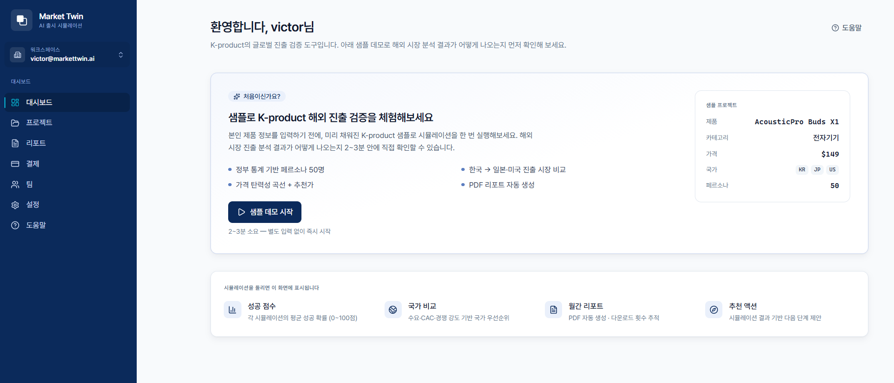
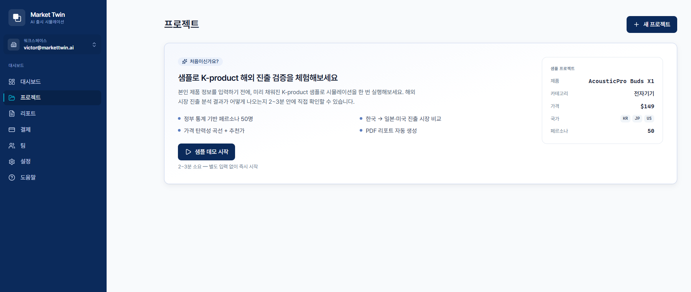

# 베타 테스트에 오신 것을 환영합니다

Market Twin **베타 테스트**에 참여해 주셔서 감사합니다. 여러분의 사용 경험과 솔직한 피드백이 정식 출시 전 제품을 다듬는 데 가장 큰 힘이 됩니다.

## 이게 어떤 제품인가요

**Market Twin**은 한국 제품을 해외에 출시하기 **전에**, 진출 후보국의 현지 소비자를 정부 통계 기반으로 모사한 AI 페르소나가 제품·가격에 어떻게 반응할지를 **몇 분 만에 시뮬레이션**하는 도구입니다. "어느 나라부터, 얼마에, 어떻게 진출할지"를 데이터로 검증합니다.

## 베타에서 해보실 일

실제로 검증하고 싶은 제품(또는 샘플 데모)으로 시뮬레이션을 직접 돌려 보시고, **결과가 의사결정에 쓸 만한지** 피드백을 남겨 주세요. 그게 베타의 핵심입니다.

## 베타 혜택 및 한도

| 항목 | 내용 |
|---|---|
| 비용 | **무료** (신용카드 불필요) |
| 기간 | 가입 후 **7일** |
| 검증 횟수 | **초기검증 2회** (실제 제품 시뮬레이션) |
| 샘플 데모 | **하루 3회** (검증 횟수와 별개, 차감 안 됨) |
| 지원 언어 | 한국어 / English |

## 공개 범위

- ✅ **시장 시뮬레이션 전체** — 성공 점수, 다국가 비교, 페르소나, 가격, 의사결정, 리스크, 추천 액션, PDF 리포트
- 🔒 **Mr.AI 마케팅 자동화 모듈은 이번 베타에서 비공개**입니다 (시뮬레이션 검증에 집중)

# 5분 안에 시작하기

1. 브라우저에서 **`app.markettwin.ai`** 접속
2. **Google로 계속하기** 또는 **이메일/비밀번호**로 가입
3. (이메일 가입 시) `noreply@markettwin.ai`로 온 **확인 메일**의 링크 클릭 → 자동 로그인
   - 메일이 안 오면 스팸함 확인 후 화면의 **"확인 메일 다시 보내기"**(60초 간격)
4. 로그인하면 **대시보드**가 첫 화면입니다.

처음 가입하면 대시보드에 **샘플 데모 카드**가 표시됩니다. 입력 부담 없이 **샘플 데모 시작**으로 해외 시장 분석 결과를 먼저 체험하세요(하루 3회, 검증 횟수 차감 없음).

실제 제품을 검증하려면 좌측 **프로젝트** 메뉴에서 우측 상단 **+ 새 프로젝트**를 누릅니다. (샘플 데모를 한 번 실행하면 대시보드에서도 **+ 새 프로젝트**가 나타납니다.)

# 첫 시뮬레이션 만들기 (6단계)

제품 정보를 6단계로 입력합니다: **1 제품 → 2 가격·목표 → 3 진출 시장 → 4 경쟁사 → 5 크리에이티브 → 6 검토·실행**. 4·5단계는 선택이라 비워도 됩니다.

| 단계 | 핵심 입력 |
|---|---|
| 1. 제품 | 제품명 · 카테고리 · 제품 설명(10자 이상) |
| 2. 가격·목표 | 기본 가격 + 통화 · 출시 목표(브랜드인지/즉시매출/재구매/신규국가) |
| 3. 진출 시장 | 진출 후보국 선택(**5개 내외 권장**) |
| 4. 경쟁사 *(선택)* | 경쟁사 이름 — AI가 URL을 찾고 추가 발굴 |
| 5. 크리에이티브 *(선택)* | 광고 컨셉/시안 이미지 — vision-AI 분석 |
| 6. 검토·실행 | 확인 후 실행 |

> **⚠️ 중요 — 입력 시 주의**: 제품 설명에 *"미국 매출 40%"* 같은 **시장 매출·점유율·진출 현황은 넣지 마세요.** 시뮬이 그 정보를 그대로 반영해 결과(추천 국가 등)를 왜곡합니다. **제품 자체의 사양만** 적으면 더 신뢰할 수 있는 추천이 나옵니다. — *베타 중 이 부분이 헷갈리셨다면 꼭 피드백 부탁드립니다.*

실행하면 수백~수천 명의 AI 페르소나가 멀티 LLM으로 시뮬레이션을 시작합니다. 화면을 닫아도 진행되며, 보통 **몇 분** 내 완료됩니다.

# 결과 읽는 법

결과는 **10개 탭**(요약·개요·국가·시장 분석·페르소나·가격·의사결정·리스크·추천 액션·데이터)으로 구성됩니다. 처음 보실 땐 아래 4곳만 봐도 핵심이 잡힙니다.

- **페르소나** — 현지 소비자의 구매의향 분포와 **긍정/부정 목소리**(1인칭 발언)

- **가격** — 권장가 vs 본인 입력가, 매출 최대점

- **의사결정** — CAC·예상 매출·**손익분기** 시나리오

- **추천 액션** — 영향×난이도 우선순위(좌상단 **Quick Wins**부터)

> 결과 화면 우측 상단 **PDF 리포트**에서 임원용·전체 분석·교차검증 3종을 내려받을 수 있습니다.

# 베타 피드백 — 가장 중요합니다 🙏

피드백을 남기는 곳은 **두 군데**입니다.

**① 시뮬레이션 결과 화면 하단** — *"이 결과가 의사결정에 도움이 되나요?"* **1~5점 + 한 줄 의견** 설문이 있습니다. (로그인 후 결과 화면) **시뮬레이션을 돌릴 때마다 꼭 남겨 주세요.** 30초면 됩니다.

**② 베타 안내 페이지(`app.markettwin.ai/beta`) 하단** — 로그인 없이 누구나 쓸 수 있는 **자유 의견 폼**입니다. 별점·분류와 함께 자세한 의견을 남길 수 있습니다.

특히 아래를 봐주시면 큰 도움이 됩니다.

- 추천된 **진출 국가**가 납득이 되나요? (이유까지)
- **가격·리스크·추천 액션**이 실제로 쓸 만한가요?
- 입력 과정에서 **헷갈리거나 불편했던 점**은?
- 결과가 나오는 **속도**는 어땠나요?
- "이런 게 있었으면" 하는 기능

설문 외 의견은 언제든 **contact@markettwin.ai** 로 보내 주세요.

# 베타 단계에서 알아두실 점

- **초기검증 티어 — 정밀도 안내**: 베타에서는 가장 가벼운 **초기검증(Hypothesis)** 분석을 제공합니다(시뮬 3회 · 페르소나 600명). 정식 버전의 **검증분석·심층분석**(시뮬 15~50회 · 페르소나 3,000~10,000명)에 비해 표본이 작아 **정확도가 낮을 수 있습니다.** 베타의 목적은 방향성 확인과 사용성 피드백이며, 정밀한 의사결정에는 상위 티어를 권장합니다.
- **결과 변동성**: 여러 독립 시뮬레이션을 앙상블로 합산하므로, 같은 입력이라도 실행마다 수치가 조금씩 달라질 수 있습니다(신뢰도 등급으로 표시).
- **국가별 데이터 편차**: 통계가 풍부한 국가일수록 정밀도가 높습니다.
- **데이터 처리**: 시뮬레이션 추론을 위해 입력 정보가 해외 LLM 제공자로 전송됩니다(가입 시 **국외이전 동의**에 따름). 결제 카드정보는 보관하지 않습니다.
- **결과 보존**: 화면을 닫아도 결과는 보존되며, 프로젝트/리포트에서 다시 볼 수 있습니다.
- **Mr.AI 비공개**: 마케팅 자동화 모듈은 이번 베타 범위가 아닙니다.

# 자주 묻는 질문 (베타)

**Q. 무료 한도를 다 쓰면 어떻게 되나요?**
베타 기간(7일) 또는 초기검증 2회를 모두 사용하면 검증 실행이 제한됩니다. 추가 검증이 필요하시면 `contact@markettwin.ai` 로 알려 주세요.

**Q. 샘플 데모도 횟수에서 차감되나요?**
아니요. 데모(하루 3회)는 초기검증 2회와 **별개**입니다.

**Q. 결과는 얼마나 걸리나요?**
샘플 데모는 2~3분, 실제 제품 검증은 보통 몇 분입니다. 화면을 닫아도 진행됩니다.

**Q. 팀원과 함께 볼 수 있나요?**
네. 결과 공유 링크를 쓰거나, 워크스페이스에 팀원을 초대할 수 있습니다.

**Q. 버그를 발견했어요.**
정말 감사합니다 🙇 화면 캡처와 함께 `contact@markettwin.ai` 로 보내 주시면 빠르게 확인하겠습니다.

# 문의 및 지원

- **이메일**: contact@markettwin.ai
- **운영사**: 주식회사 미스터에이아이 (Mr.AI Inc.)

베타 기간 중 발견하신 오류·불편·아이디어는 무엇이든 환영합니다. 보내주신 한 줄이 제품을 바꿉니다. 함께해 주셔서 감사합니다.

*본 가이드의 화면은 베타 진행에 따라 일부 다를 수 있습니다. © 2026 주식회사 미스터에이아이.*
