# Document Information

| Item | Detail |
|---|---|
| Document | Market Twin User Manual |
| Product | Market Twin (AI Launch Simulation) |
| Version | v1.0 |
| Published | June 2026 |
| Publisher | Mr.AI Inc. (주식회사 미스터에이아이) |
| Contact | contact@markettwin.ai |
| Audience | Marketing, strategy, and management leads validating an overseas launch with Market Twin |

**Revision history**

| Version | Date | Notes |
|---|---|---|
| v1.0 | 2026-06 | Initial release |

# 1. Introduction

## 1.1 Overview

**Market Twin** is a SaaS that lets you **validate an overseas launch with a simulation — before** you ship. AI personas, modeled on government statistics for each candidate country's local consumers, react to your product, price, and creative.

Where traditional market research takes weeks to months and costs tens of thousands of dollars, Market Twin delivers the following **in just 5-6 minutes**:

- Which country to enter first (recommended markets)
- How local consumers react to your product and price
- What the right price is
- What the risks and go-to-market strategy are

## 1.2 Core Value

| Value | Description |
|---|---|
| Launch success score | 0–100 score based on demand, CAC, and competitive intensity |
| Multi-country comparison | Objective comparison grounded in government statistics (KOSIS, BLS, e-Stat) |
| AI persona simulation | Precise analysis down to occupation, income band, and purchase intent |
| Regulatory pre-check | Markets where the product can't legally be sold are excluded automatically |

## 1.3 Who It's For

Founders, marketing/strategy leads, export managers at SMEs and startups preparing to go global, plus accelerators and investors. Designed so that **non-technical users** can run it with 5 minutes of input.

## 1.4 Requirements

- **Access**: Web browser (latest Chrome, Edge, or Safari recommended); no installation
- **URL**: `app.markettwin.ai`
- **Languages**: Korean / English (switch in Settings)

# 2. Getting Started

## 2.1 Access & Sign-up

1. Go to **`app.markettwin.ai`** in your browser.
2. Choose a sign-up method on the login screen.
   - **Continue with Google**: instant sign-up/login with a Google account
   - **Email/password**: enter an email and a password (8+ characters)
3. Agree to the Terms, Privacy Policy, and cross-border transfer notice (required) to finish.

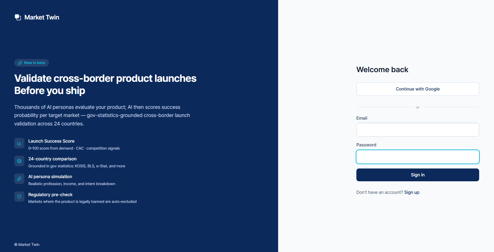

## 2.2 Email Verification

If you signed up by email, **email verification** is required for security.

1. Right after sign-up, a "Verify your email" screen appears.
2. Click the link in the **verification email** sent from `noreply@markettwin.ai`.
3. Once verified, you're logged in automatically.

> **No verification email?** ① Check your spam folder, then ② click **"Resend confirmation email"** on the login/sign-up screen (60-second interval). If it still doesn't arrive, contact `contact@markettwin.ai`.

## 2.3 Login

- Log in with the method you signed up with (Google or email).
- If you try to log in while unverified, you'll see a prompt with a **"Resend confirmation email"** button.

# 3. Dashboard

After login, the Dashboard is your home screen. The left navigation (Dashboard · Projects · Reports · Billing · Team · Settings · Help) gives access to every feature.

## 3.1 First Sign-up — Sample Demo

On first sign-up, the dashboard shows a **sample demo card**. With a pre-filled K-product sample, click **Start sample demo** — no input needed — to see what an overseas-market analysis looks like in 2–3 minutes (3 per day, separate from your validation runs).

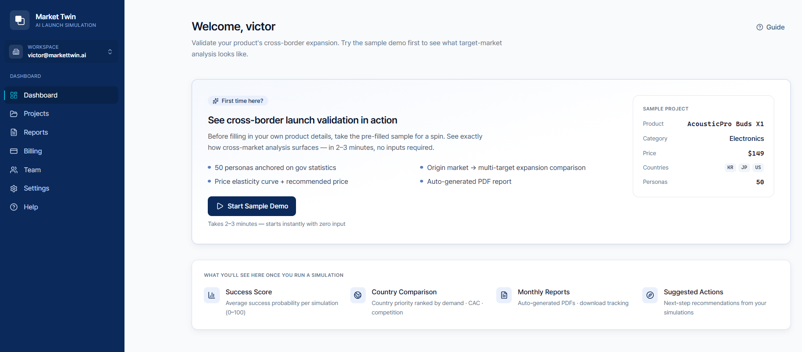

## 3.2 Metric Cards (after running a simulation)

Once you run a simulation, the dashboard shows metric cards and a recent-projects list at the top.

| Card | Meaning |
|---|---|
| Active projects | Number of projects currently running |
| Avg. success score | Average launch success score of completed simulations (0–100) |
| Countries tested | Number of countries used in analysis |
| Reports this month | Reports generated this month |

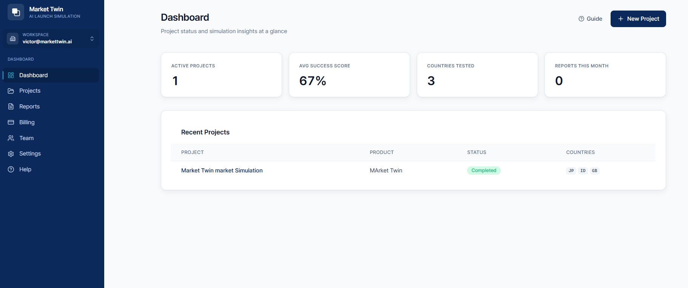

## 3.3 Starting a New Project

To validate a real product, go to **Projects** in the left menu and click **+ New Project** at the top right (see Chapter 4). After you run the sample demo once, **+ New Project** also appears at the top right of the dashboard.

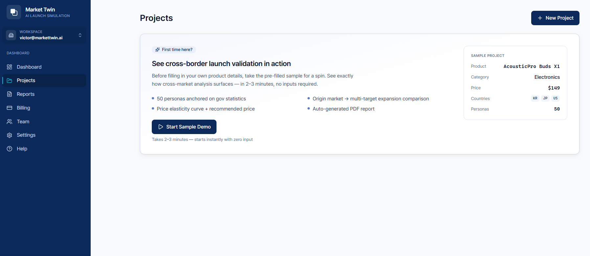

# 4. Creating a Project (6-step wizard)

Enter your product over six steps. The progress bar at the top (**1 Product → 2 Price & Goal → 3 Target Markets → 4 Competitors → 5 Creative → 6 Review & Run**) shows where you are.

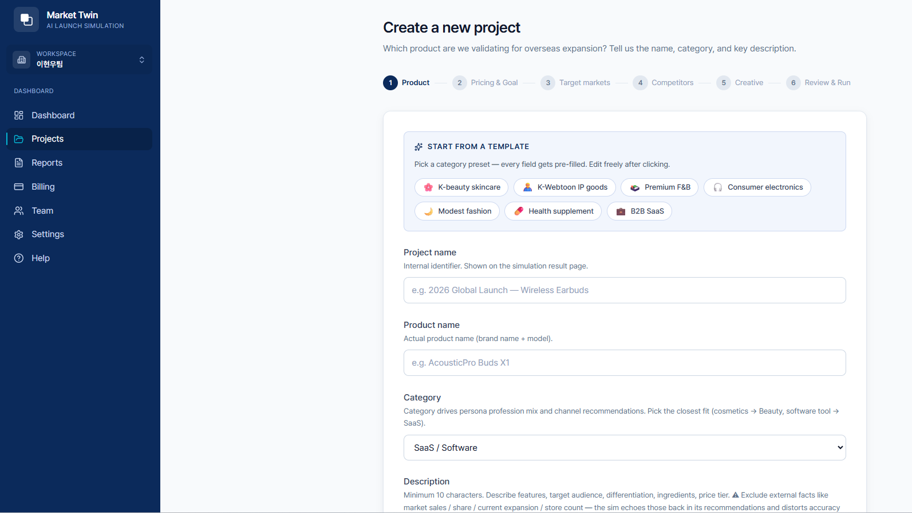

> **Tip — start from a template**: Click a category preset at the top (K-beauty skincare / K-webtoon IP goods / premium food & beverage / premium appliance / modest fashion / health supplement / B2B SaaS) to auto-fill every field with an example. Edit freely afterward.

## 4.1 Step 1 — Product

| Field | Description |
|---|---|
| Project name | Internal label. Shown on the results page. |
| Product name | Actual brand/model name |
| Category | Affects persona occupation distribution and channel recommendations. Pick the closest match. |
| Description | 10+ characters. Freely write features, target, differentiators, ingredients, price range. |

> **Caution — leave out external facts.** Do not enter market figures like "40% of sales in the US" (sales share, market position, current presence). The simulation takes them at face value and skews accuracy (e.g. "40% US sales" → it auto-recommends the US). Describe **only the product itself** for a more reliable market recommendation.

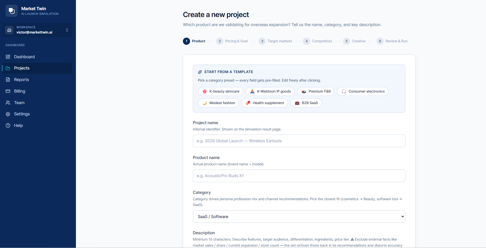

## 4.2 Step 2 — Price & Goal

| Field | Description |
|---|---|
| Base price + currency | Your current or candidate launch price. The simulation builds a price curve across a **±50% range**. |
| Launch goal | Pick the top-priority KPI for this launch. It changes persona scenarios and channel recommendations. |

**Four launch goals**

- **Brand awareness** — new-brand exposure and content reach
- **Instant sales conversion** — immediate revenue at launch, price optimization first
- **Repeat & retention** — repeat purchase / LTV, loyal-customer focus
- **New-market entry** — expanding from an existing market to new countries

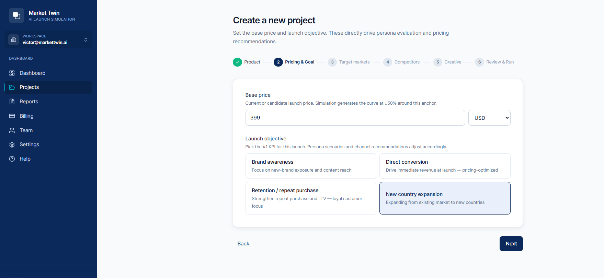

## 4.3 Step 3 — Target Markets

| Field | Description |
|---|---|
| Origin country | The home country your company launches/operates from. The simulation evaluates candidate markets relative to it. Default: South Korea. |
| Candidate markets | Pick one or more overseas markets to validate. Given cost/time, **~5 is recommended** (24+ countries supported). |

> Adding your origin country to the candidates also yields a domestic score (for comparison with overseas options). However, the "Top-2 recommended markets" are chosen only from overseas candidates.

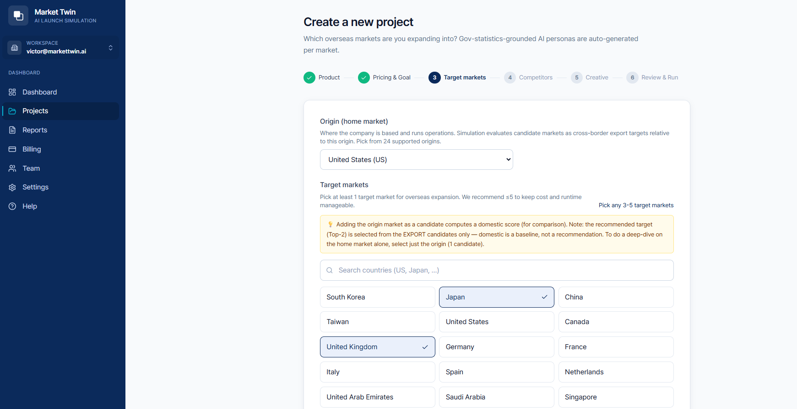

## 4.4 Step 4 — Competitors (optional)

| Field | Description |
|---|---|
| Competitor product/brand names | One per line. AI finds URLs and discovers 2–3 competitors you may have missed. |
| Competitor URLs | Only when you want a specific URL included. Leave blank and AI finds URLs from the names above. |

> The results screen distinguishes "what you entered" from "what AI discovered." Competitor discovery adds 3–8 seconds to project creation.

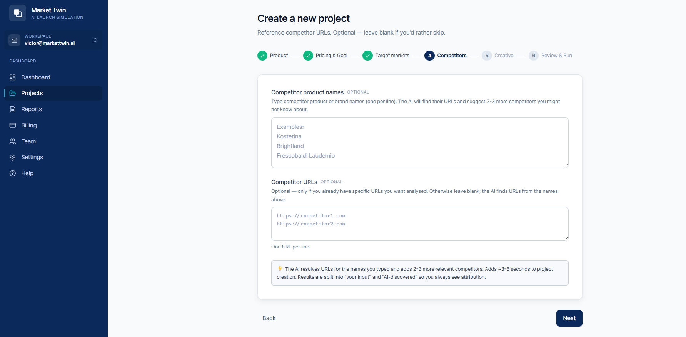

## 4.5 Step 5 — Creative (optional)

| Field | Description |
|---|---|
| Creative concept | One per line, rough description, of concepts you'd run (or are considering). The results show a **0–100 score + per-market strengths/weaknesses** per concept. |
| Mockup image upload | Upload a mockup (JPG/PNG/WebP/GIF, ≤4MB each). **Vision-AI** reads the actual visual for more accurate analysis. |
| Image URLs | Paste already-hosted public URLs, one per line, for the same effect. |

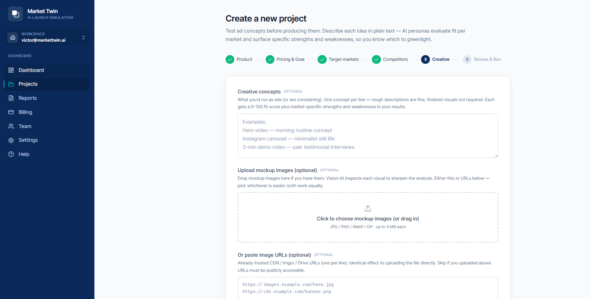

## 4.6 Step 6 — Review & Run

Review the inputs and **Run**. Depending on the tier you chose, 600–10,000 AI personas start simulating across multiple LLMs.

# 5. Running the Simulation

When you run it, a progress screen appears. Multiple independent simulations run **in parallel** to produce a reliable result (the ensemble approach).

- Progress and completed-sim counts update in real time.
- Turn on **browser notification on completion** to be alerted while doing other work.
- You can close the screen — the simulation keeps running, and you'll find results on the results page when done.
- Time: the sample demo takes 2–3 minutes; a real product validation usually 5-6 minutes.

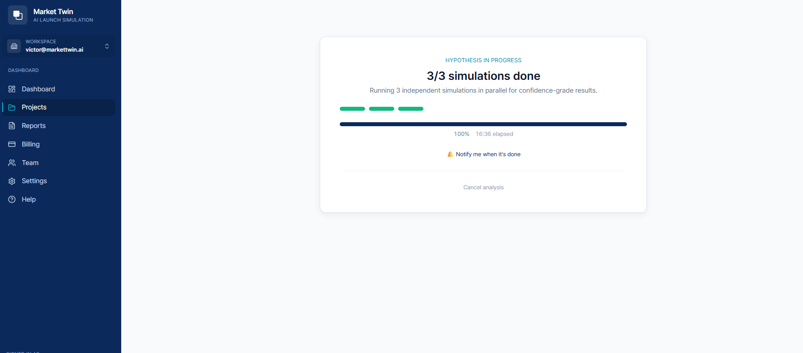

# 6. Reading Results

The top of the results screen shows the tier, sim count, persona count, and LLMs used (e.g. **Decision Plus · 15 sims · 3,000 personas · CLAUDE·GPT-4·DEEPSEEK**), with results across **10 tabs** below.

| Tab | Content |
|---|---|
| Summary | Consensus narrative merging all sims |
| Overview | Key metrics summary |
| Countries | Per-country score and vote share |
| Market Analysis | Market size (TAM), growth trend, reachable segment, competitor analysis |
| Personas | Persona stats, purchase-intent distribution, positive/negative voices, age/occupation distribution |
| Pricing | Recommended price vs. your input, revenue index |
| Decision | Investment required, CAC, ROI, break-even |
| Risk | Overall risk level, individual risks |
| Actions | Impact × difficulty priority matrix |
| Data | Raw data |

## 6.1 Personas Tab

Persona stats (total personas, average purchase intent, strong interest ≥70, weak interest <35), a purchase-intent histogram, average intent by country, and age/occupation distribution (Top 12).

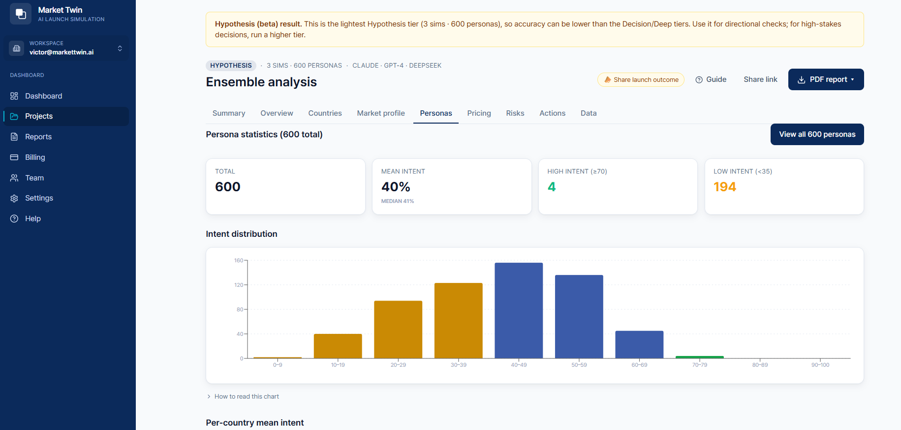

At the bottom, the **positive personas' voices** and **negative personas' voices** appear with first-person quotes and profiles (country, intent score, occupation, age). You can read directly what attracts real consumers and what makes them hesitate.

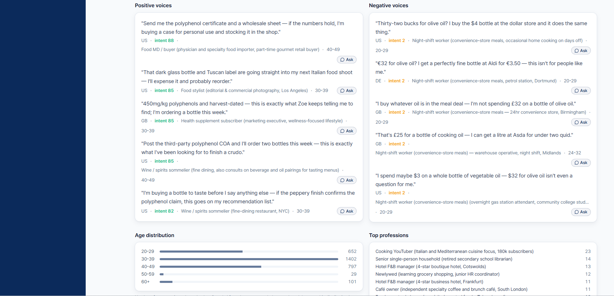

## 6.2 Market Analysis Tab

Market size for the recommended country (TAM estimate, growth trend, reachable segment, with source links) plus **competitor analysis**. Each competitor is compared on threat level (high/medium/low), origin, overview, strengths, weaknesses, and price.

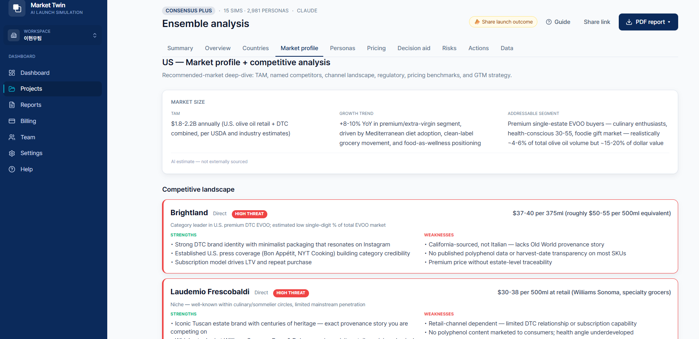

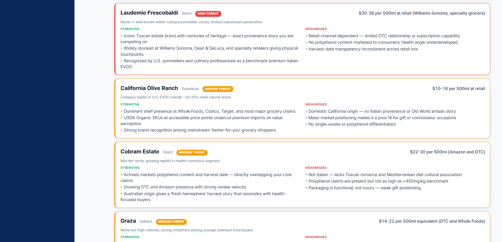

## 6.3 Pricing Tab

Recommended price (median across sims), the middle 50% band, a comparison of **your input vs. LLM recommendation vs. the curve's revenue-maximizing point**, and a Top-5 revenue index (price × conversion) — validating the right price with data.

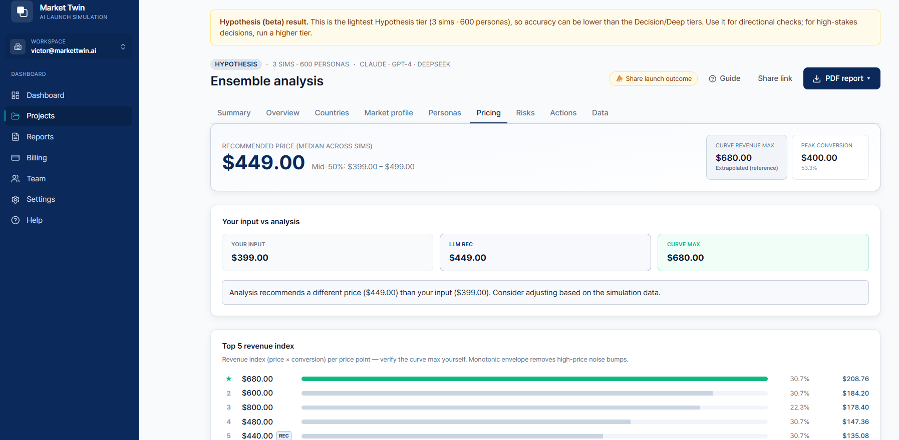

## 6.4 Decision Tab

Unit price, **CAC (customer acquisition cost)**, **M:R (marketing-to-revenue)**, marketing budget and expected revenue by customer count, and **break-even scenarios** — supporting your investment decision.

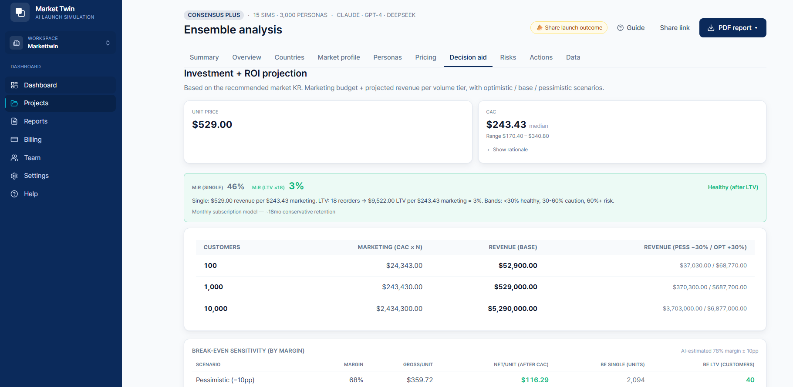

## 6.5 Risk Tab

The overall risk level plus individual risks (HIGH/MEDIUM) with descriptions, the number of sims that surfaced them, and consensus rate. Identify, in priority order, the barriers to clear before launch.

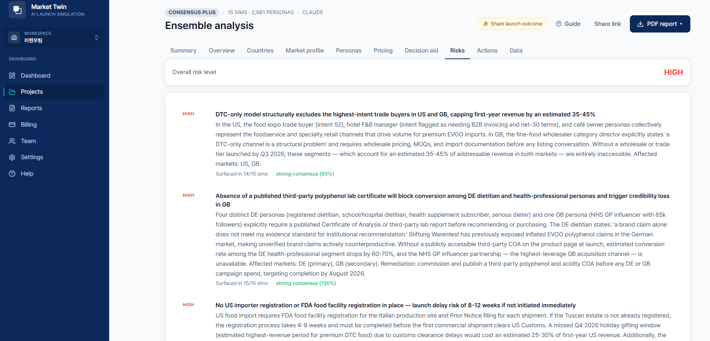

## 6.6 Actions Tab

A priority matrix placing each action by **impact (vertical) × difficulty (horizontal)**. Start top-left with **Quick Wins** (high impact, easy), then review Strategic / Marginal / Avoid.

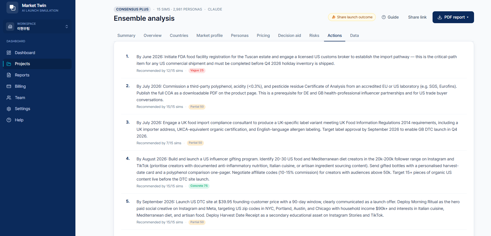

## 6.7 Beta Feedback

At the bottom of the results screen, send feedback via *"Was this result useful for your decision?"* (1–5) plus a one-line comment. Your input goes straight into improving the product.

# 7. Asking a Persona

Click **"Ask"** on any persona card to ask that persona a natural-language question and get a first-person answer (e.g. "Which channel do you prefer to buy from?"). You can directly probe purchase motivation, channel preference, and objection reasons that quantitative stats alone can't reveal.

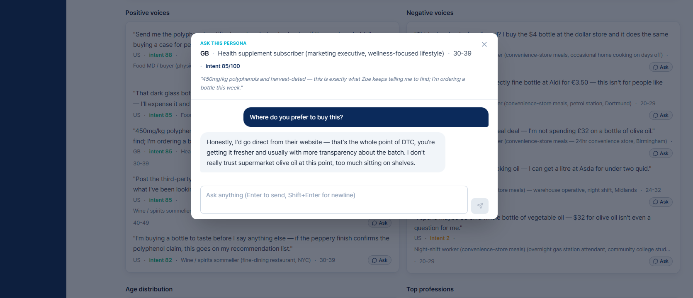

# 8. PDF Reports

From **PDF Report** at the top right of the results screen, download three formats by purpose.

| Type | Length | Use |
|---|---|---|
| Executive | 2–3 pages | Hot take, recommended country, key actions, pricing (exec briefing) |
| Full analysis | ~30 pages | Investment+ROI, recommendation robustness, intent by occupation, channel priority, risk × action |
| Cross-validation | McKinsey/BCG style | Consistency with external market data, confidence grade, staged execution |

A report flows: consensus opinion → market situation + competitors → GTM strategy summary → 30/60/90-day execution timeline → per-country detail.

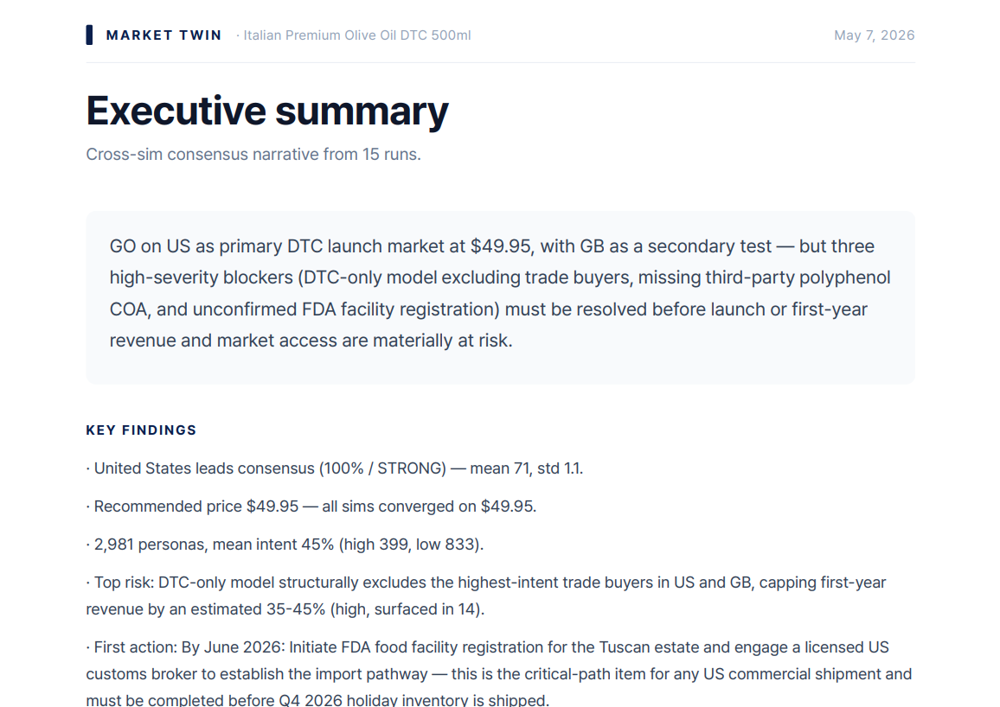

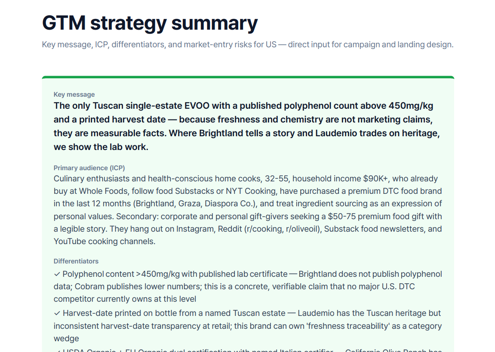

# 9. Settings

Manage your profile, workspace, and notifications under **Settings** in the left menu.

| Area | Items |
|---|---|
| Profile | Email, display language (Korean/English) |
| Workspace info | Name, company, industry, country (shown on results page / PDF header) |
| Plan / created | Current plan and workspace creation date |
| Email notifications | Receive results at your registered email on simulation completion/failure |

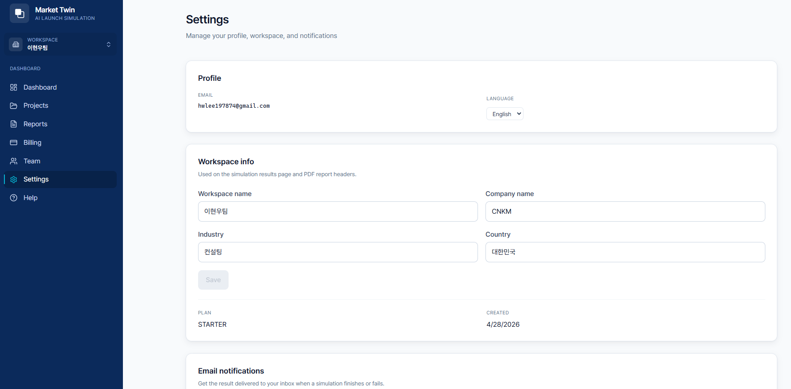

# 10. Frequently Asked Questions (FAQ)

**Q. How long do results take?**
The sample demo takes 2–3 minutes; a real product validation usually 5-6 minutes. Results are kept even if you close the screen.

**Q. What's free?**
During the beta, 7 days or 2 hypothesis validations are free, with no credit card. The sample demo is available 3 times a day separately.

**Q. Does the sample demo count against my free runs?**
No. The sample demo is separate from your free validation runs.

**Q. Is my product information safe?**
For simulation inference, it is sent to overseas LLM providers, per the cross-border transfer notice you agreed to at sign-up. Payment card details are not stored (tokenized by the PG).

**Q. Can I share results with my team?**
Yes. Share via the results-screen link, or invite teammates to your workspace and collaborate by role (owner/admin/analyst/viewer).

# 11. Troubleshooting

| Symptom | Action |
|---|---|
| Verification email not arriving | Check spam → "Resend confirmation email" (60s interval) → still nothing, contact `contact@markettwin.ai` |
| Can't log in | Check your sign-up method (Google/email) and whether email verification is complete |
| Simulation seems stuck | It keeps running in the background even if you close the screen. Check the results page shortly. |
| Results look off | Check you didn't put external facts (sales/share) in the description (see §4.1 caution) |
| Recommendation skews to one country | Check the description/inputs for phrasing that implies a specific country |

# 12. Glossary

| Term | Meaning |
|---|---|
| Launch success score | 0–100 composite based on demand, CAC, competitive intensity |
| Persona | A virtual local consumer generated from government statistics |
| Purchase intent | A persona's intent-to-buy score (0–100) |
| Ensemble | Running multiple independent simulations in parallel to raise reliability |
| TAM | Total Addressable Market |
| CAC | Customer Acquisition Cost |
| M:R | Marketing-to-Revenue ratio |
| LTV | Life-Time Value |
| BREAK-EVEN | Break-even point |
| GTM | Go-To-Market strategy |
| Hypothesis | The base analysis tier offered in the free trial |

# 13. Support & Contact

- **Email**: contact@markettwin.ai
- **Operated by**: Mr.AI Inc. (주식회사 미스터에이아이)
- Found a bug or have an improvement idea during the beta? Email us anytime and we'll fold it into the product.

*Screens in this manual may differ slightly by product version. © 2026 Mr.AI Inc.*
