# 문서 정보

| 항목 | 내용 |
|---|---|
| 문서명 | Market Twin 사용자 매뉴얼 |
| 제품명 | Market Twin (AI 출시 시뮬레이션) |
| 문서버전 | v1.0 |
| 발행일 | 2026년 6월 |
| 발행처 | 주식회사 미스터에이아이 (Mr.AI Inc.) |
| 문의 | contact@markettwin.ai |
| 대상 독자 | Market Twin을 사용해 해외 진출을 검증하려는 마케팅·전략·경영 담당자 |

**개정 이력**

| 버전 | 일자 | 내용 |
|---|---|---|
| v1.0 | 2026-06 | 최초 발행 |

# 1. 소개

## 1.1 제품 개요

**Market Twin**은 한국 제품(K-product)을 해외 시장에 출시하기 **전에**, 진출 후보국의 현지 소비자를 정부 통계 기반으로 모사한 AI 페르소나가 제품·가격·크리에이티브에 어떻게 반응할지를 **시뮬레이션으로 검증**하는 SaaS입니다.

기존 시장조사가 수 주~수 개월, 수천만 원이 드는 데 비해, Market Twin은 **몇 분 내**에 다음을 제시합니다.

- 어느 나라부터 진출해야 하는가 (추천 시장)
- 현지 소비자가 제품·가격에 어떻게 반응하는가
- 적정 가격은 얼마인가
- 진출 시 리스크와 실행 전략은 무엇인가

## 1.2 핵심 가치

| 가치 | 설명 |
|---|---|
| 출시 성공 점수 | 수요·고객획득비용(CAC)·경쟁 강도 기반 0~100점 평가 |
| 다국가 시장 비교 | KOSIS·BLS·e-Stat 등 정부 통계로 grounding한 객관적 비교 |
| AI 페르소나 시뮬레이션 | 직업·소득대·구매 의향까지 정밀 분석 |
| 규제 사전 검증 | 법적으로 판매 불가능한 시장은 자동 제외 |

## 1.3 대상 사용자

해외 진출을 준비 중인 중소기업·스타트업의 대표, 마케팅·전략 담당자, 수출 담당자, 액셀러레이터·투자사 등. **비기술자도** 5분 입력으로 사용할 수 있도록 설계되었습니다.

## 1.4 이용 환경

- **접속**: 웹 브라우저(Chrome·Edge·Safari 최신 버전 권장), 별도 설치 불필요
- **주소**: `app.markettwin.ai`
- **언어**: 한국어 / English (설정에서 전환)

# 2. 시작하기

## 2.1 접속 및 회원가입

1. 브라우저에서 **`app.markettwin.ai`** 에 접속합니다.
2. 로그인 화면에서 가입 방식을 선택합니다.
   - **Google로 계속하기**: 구글 계정으로 즉시 가입·로그인
   - **이메일/비밀번호**: 이메일 주소와 비밀번호(8자 이상) 입력
3. 약관·개인정보 처리방침·국외이전에 동의(필수)한 뒤 가입을 완료합니다.

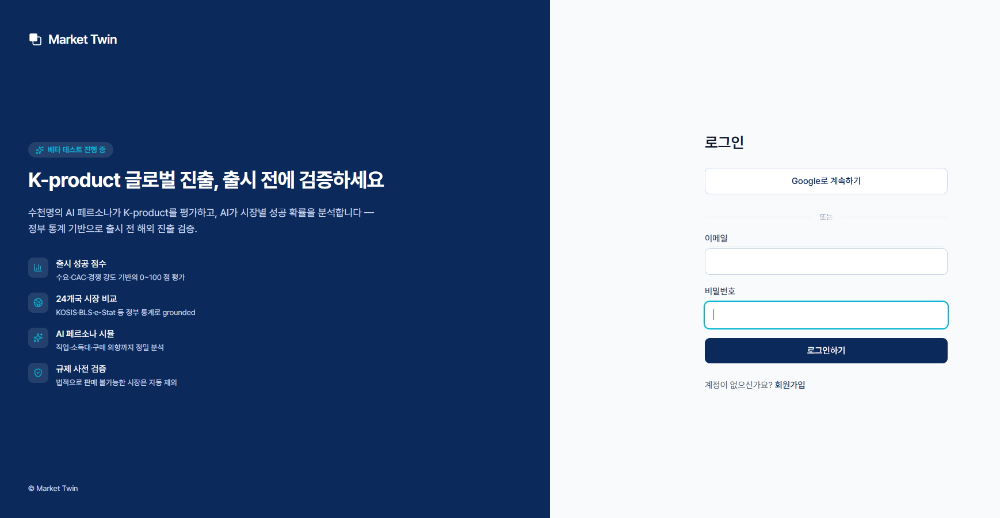

## 2.2 이메일 인증

이메일로 가입한 경우, 보안을 위해 **이메일 인증**이 필요합니다.

1. 가입 직후 "이메일을 확인하세요" 화면이 표시됩니다.
2. `noreply@markettwin.ai`로 발송된 **인증 메일**의 링크를 클릭합니다.
3. 인증이 완료되면 자동으로 로그인됩니다.

> **인증 메일이 오지 않을 때**: ① 스팸함을 확인하고, ② 로그인/가입 화면의 **"확인 메일 다시 보내기"** 버튼을 누릅니다(60초 간격). 그래도 오지 않으면 `contact@markettwin.ai`로 문의하세요.

## 2.3 로그인

- 가입한 방식(구글 또는 이메일)으로 로그인합니다.
- 미인증 상태로 로그인을 시도하면 인증 안내와 함께 **"확인 메일 다시 보내기"** 버튼이 표시됩니다.

# 3. 대시보드

로그인하면 대시보드가 첫 화면으로 표시됩니다. 좌측 내비게이션 메뉴(대시보드·프로젝트·리포트·결제·팀·설정·도움말)와 상단 지표 카드, 최근 프로젝트 목록으로 구성됩니다.

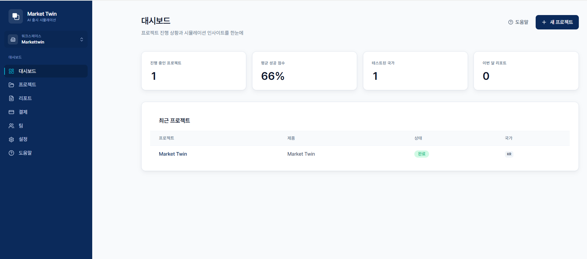

## 3.1 지표 카드

| 카드 | 의미 |
|---|---|
| 진행 중 프로젝트 | 현재 실행 중인 프로젝트 수 |
| 평균 성공 점수 | 완료된 시뮬레이션의 평균 출시 성공 점수(0~100) |
| 테스트된 국가 | 분석에 사용된 국가 수 |
| 이번 달 리포트 | 당월 생성한 리포트 수 |

## 3.2 새 프로젝트 시작

우측 상단 **+ 새 프로젝트** 버튼을 누르면 프로젝트 생성 위저드로 진입합니다(4장 참조).

# 4. 프로젝트 생성 (6단계 위저드)

검증할 제품 정보를 6단계로 입력합니다. 상단의 진행 표시(**1 제품 → 2 가격·목표 → 3 진출 시장 → 4 경쟁사 → 5 크리에이티브 → 6 검토·실행**)로 현재 위치를 확인할 수 있습니다.

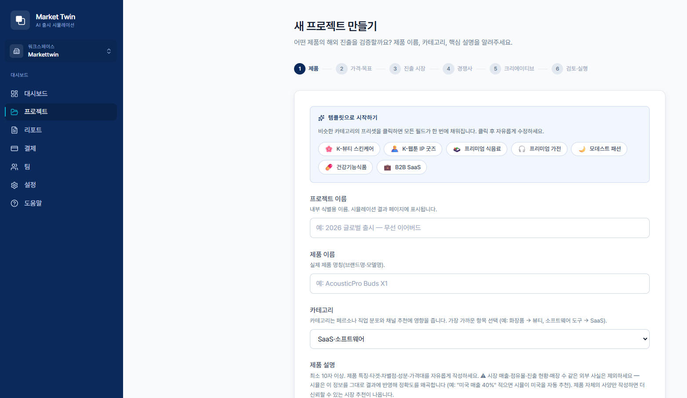

> **팁 — 템플릿으로 시작하기**: 화면 상단의 카테고리 프리셋(K-뷰티 스킨케어 / K-웹툰 IP 굿즈 / 프리미엄 식음료 / 프리미엄 가전 / 모데스트 패션 / 건강기능식품 / B2B SaaS)을 클릭하면 모든 필드가 예시로 자동 채워집니다. 클릭 후 자유롭게 수정하세요.

## 4.1 Step 1 — 제품

| 입력 항목 | 설명 |
|---|---|
| 프로젝트 이름 | 내부 식별용 명칭. 결과 페이지에 표시됩니다. |
| 제품 이름 | 실제 브랜드명·모델명 |
| 카테고리 | 페르소나 직업 분포·채널 추천에 영향을 줍니다. 가장 가까운 항목을 선택하세요. |
| 제품 설명 | 최소 10자. 제품 특징·타겟·차별점·성분·가격대를 자유롭게 작성합니다. |

> **주의 — 외부 사실은 제외하세요.** "미국 매출 40%" 같은 시장 매출·점유율·진출 현황은 입력하지 마세요. 시뮬이 이 정보를 그대로 결과에 반영해 정확도를 왜곡합니다(예: "미국 매출 40%" → 시뮬이 미국을 자동 추천). **제품 자체의 사양만** 작성하면 더 신뢰할 수 있는 시장 추천이 나옵니다.

## 4.2 Step 2 — 가격·목표

| 입력 항목 | 설명 |
|---|---|
| 기본 가격 + 통화 | 현재 책정 중이거나 출시 후보 가격. 시뮬레이션이 **±50% 범위**에서 가격 곡선을 생성합니다. |
| 출시 목표 | 이 출시의 1순위 KPI를 선택합니다. 페르소나 시나리오·채널 추천이 달라집니다. |

**출시 목표 4종**

- **브랜드 인지도** — 신규 브랜드 노출과 콘텐츠 도달 확대 위주
- **즉시 매출 전환** — 출시 시점 즉시 매출 발생, 가격 최적화 우선
- **재구매·리텐션** — 재구매·LTV 강화, 충성 고객 분석 중점
- **신규 국가 진출** — 기존 시장에서 신규 국가로 확장하는 시나리오

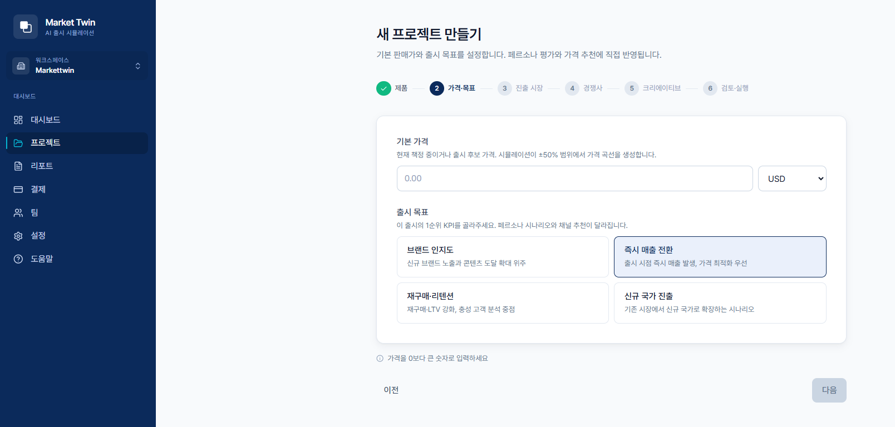

## 4.3 Step 3 — 진출 시장

| 입력 항목 | 설명 |
|---|---|
| 출시 모국(Origin) | 회사가 출시·운영하는 모국. 시뮬레이션은 이 국가를 기준으로 후보 시장을 평가합니다. 기본값: 대한민국. |
| 진출 후보 시장 | 검증할 해외 시장을 1개 이상 선택. 비용·시간을 고려해 **5개 내외 권장**(24개국+ 지원). |

> 출시 모국도 후보에 추가하면 도메스틱 점수가 함께 산출됩니다(해외 옵션과 비교용). 단 "추천 진출국 Top-2"는 해외 후보 중에서만 선정됩니다.

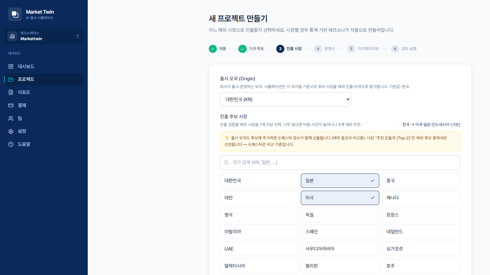

## 4.4 Step 4 — 경쟁사 (선택)

| 입력 항목 | 설명 |
|---|---|
| 경쟁사 제품·브랜드 이름 | 한 줄에 하나씩. AI가 URL을 찾아주고, 미처 떠올리지 못한 경쟁사 2~3개도 추가 발굴합니다. |
| 경쟁사 URL | 분석에 꼭 포함하고 싶은 특정 URL이 있을 때만. 비워두면 위 이름에서 AI가 URL을 찾습니다. |

> 입력한 이름은 결과 화면에서 "내가 입력한 것"과 "AI가 발굴한 것"을 구분해 보여줍니다. 경쟁사 발굴로 프로젝트 생성에 3~8초가 추가됩니다.

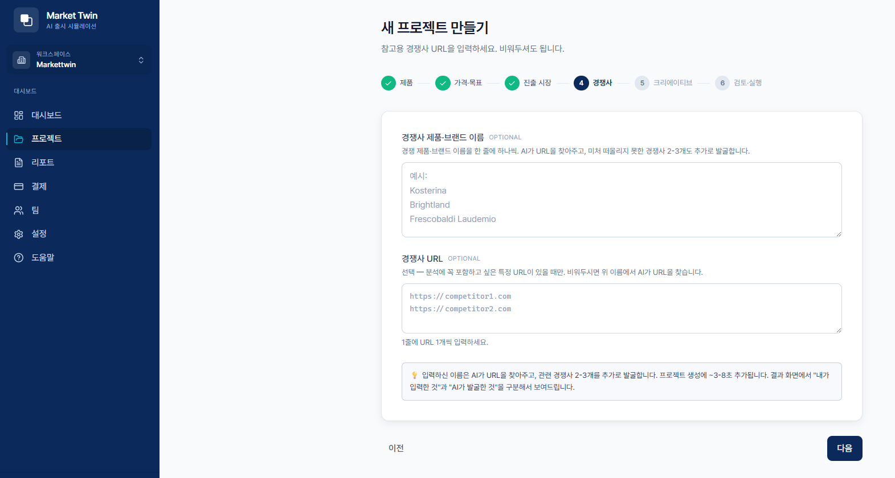

## 4.5 Step 5 — 크리에이티브 (선택)

| 입력 항목 | 설명 |
|---|---|
| 크리에이티브 컨셉 | 광고로 집행할(또는 고려 중인) 컨셉을 한 줄에 하나씩, 거친 설명으로 입력. 결과 화면에서 컨셉별 **0~100 점수 + 시장별 강점·약점**이 출력됩니다. |
| 시안 이미지 업로드 | 시안이 있으면 업로드(JPG/PNG/WebP/GIF, 파일당 ≤4MB). **vision-AI**가 실제 시각 자료를 보고 더 정확하게 분석합니다. |
| 이미지 URL | 이미 호스팅된 공개 URL을 한 줄에 하나씩 붙여넣어도 동일한 효과입니다. |

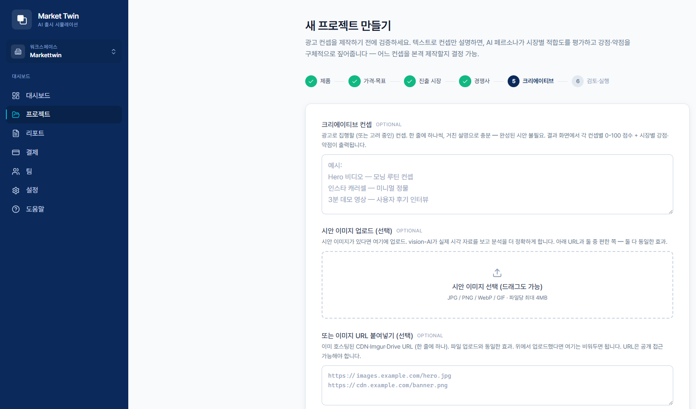

## 4.6 Step 6 — 검토·실행

입력 내용을 최종 확인한 뒤 **실행**합니다. 선택한 분석 티어에 따라 600~10,000명의 AI 페르소나가 멀티 LLM으로 시뮬레이션을 시작합니다.

# 5. 시뮬레이션 실행 및 진행

실행하면 진행 화면이 표시됩니다. 여러 개의 독립 시뮬레이션을 **병렬 실행**하여 신뢰도 있는 결과를 도출합니다(앙상블 방식).

- 진행률과 완료된 시뮬 수가 실시간 표시됩니다.
- **완료 시 브라우저 알림 받기**를 켜두면 다른 작업 중에도 완료를 알 수 있습니다.
- 화면을 닫아도 시뮬레이션은 계속 진행되며, 완료되면 결과 페이지에서 확인할 수 있습니다.
- 소요 시간: 샘플 데모는 2~3분, 실제 제품 검증은 보통 몇 분입니다.

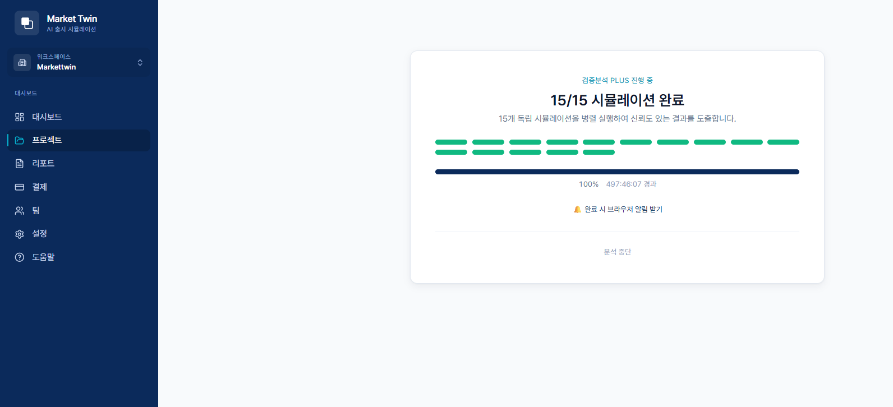

# 6. 결과 분석

결과 화면 상단에 분석 티어·시뮬 수·페르소나 수·사용 LLM(예: **검증분석 PLUS · 15개 시뮬 · 3,000 페르소나 · CLAUDE·GPT-4·DEEPSEEK**)이 표시되고, 아래 **10개 탭**으로 결과를 확인합니다.

| 탭 | 내용 |
|---|---|
| 요약 | 모든 시뮬을 통합한 합의 narrative(종합 의견) |
| 개요 | 핵심 지표 요약 |
| 국가 | 후보국별 점수·득표율 |
| 시장 분석 | 시장 규모(TAM)·성장 추세·도달 세그먼트·경쟁자 분석 |
| 페르소나 | 페르소나 통계·구매의향 분포·긍정/부정 목소리·연령/직업 분포 |
| 가격 | 권장 가격·본인 입력가 대비·매출 인덱스 |
| 의사결정 | 투자 요구치·CAC·ROI·손익분기 |
| 리스크 | 종합 리스크 수준·개별 리스크 |
| 추천 액션 | 영향×난이도 우선순위 매트릭스 |
| 데이터 | 원시 데이터 |

## 6.1 페르소나 탭

페르소나 통계(총 페르소나 수, 평균 구매의향, 강한 관심 ≥70, 약한 관심 <35), 구매의향 분포 히스토그램, 국가별 평균 구매의향, 연령대·직업 분포(Top 12)를 제공합니다.

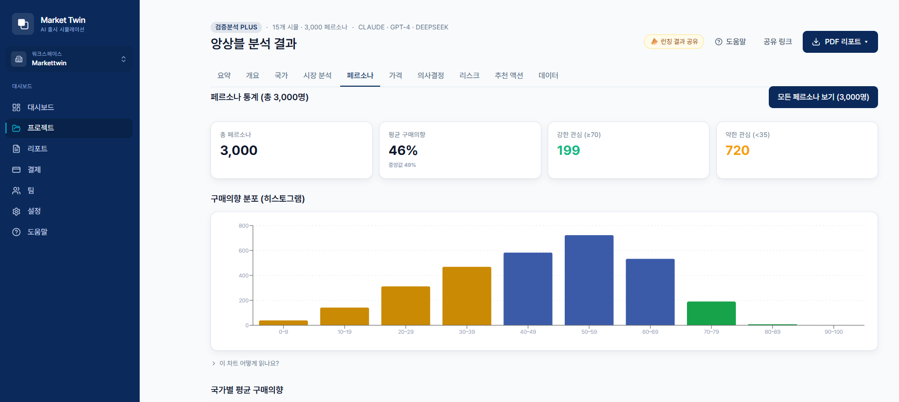

화면 하단에는 **긍정 페르소나의 목소리**와 **부정 페르소나의 목소리**가 1인칭 발언과 프로필(국가·의향 점수·직업·연령)과 함께 표시됩니다. 실제 소비자가 무엇에 끌리고 무엇 때문에 망설이는지 직접 읽을 수 있습니다.

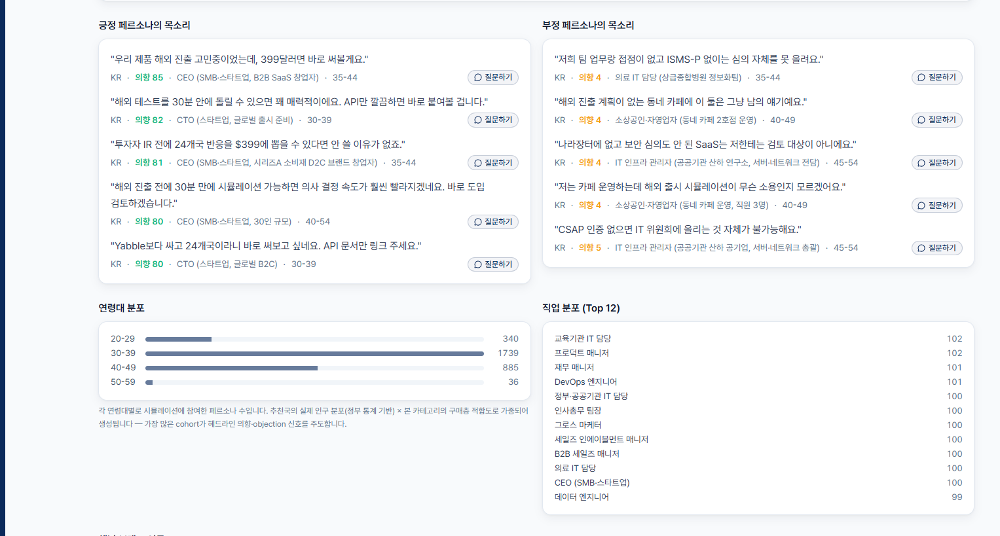

## 6.2 시장 분석 탭

추천 진출국의 시장 규모(TAM 추정·성장 추세·도달 세그먼트, 출처 링크 포함)와 **경쟁자 분석**을 제공합니다. 경쟁사별로 위협도(높음/중/낮음)·원산지·개요·강점·약점·가격을 비교합니다.

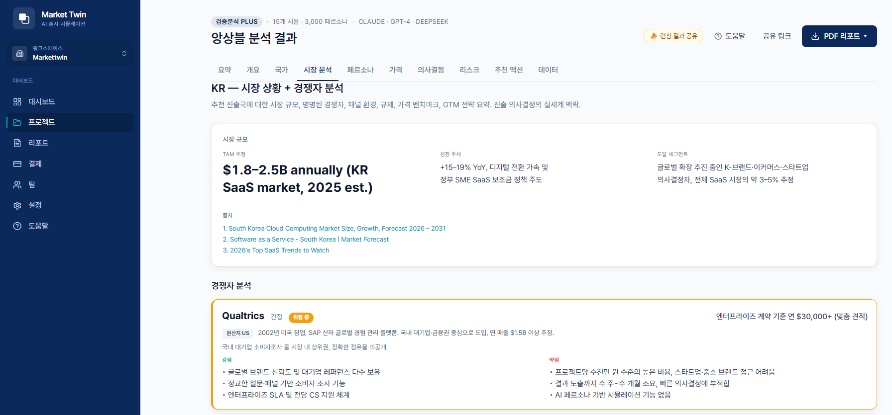

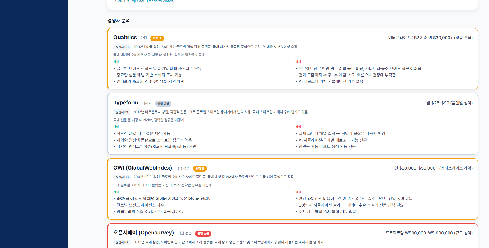

## 6.3 가격 탭

권장 가격(시뮬 합산 중앙값)과 중간 50% 구간, **본인 입력가 vs LLM 추천 vs 곡선 매출 최대점** 비교, 매출 인덱스 Top 5(가격×전환율)를 제공해 적정 가격을 데이터로 검증합니다.

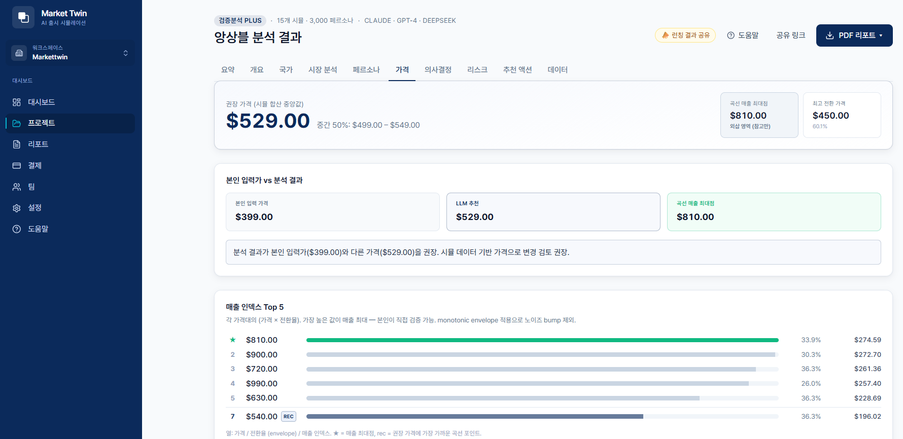

## 6.4 의사결정 탭

단가, **CAC(고객 획득 비용)**, **M:R(마케팅 대 매출 비율)**, 고객 수별 마케팅 예산·예상 매출, **손익분기(BREAK-EVEN) 시나리오**를 제공해 투자 의사결정을 지원합니다.

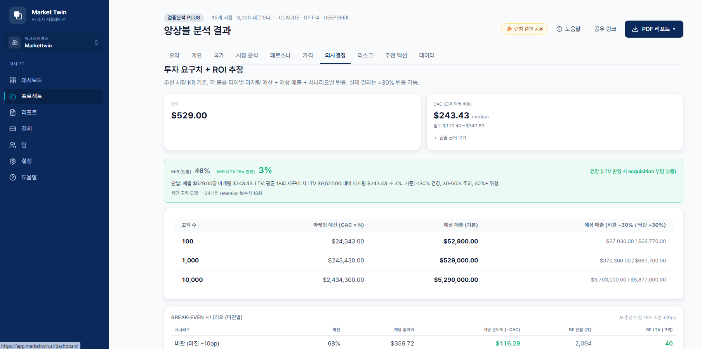

## 6.5 리스크 탭

종합 리스크 수준과 함께 개별 리스크(HIGH/MEDIUM)를 설명·언급 시뮬 수·합의율과 함께 제시합니다. 출시 전에 선행 해소해야 할 장벽을 우선순위로 파악할 수 있습니다.

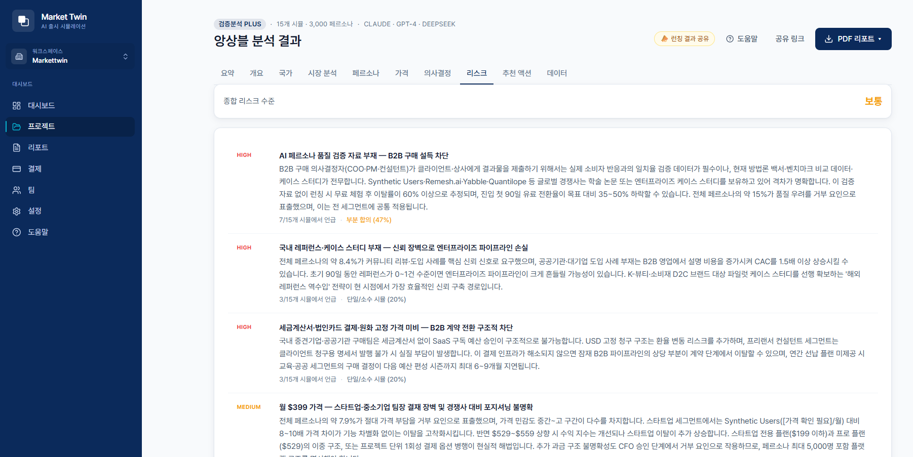

## 6.6 추천 액션 탭

각 액션을 **영향(세로) × 실행 난이도(가로)**로 배치한 우선순위 매트릭스를 제공합니다. 좌상단 **Quick Wins**(영향 큼·쉬움)부터 시작하고, Strategic / Marginal / Avoid 순으로 검토합니다.

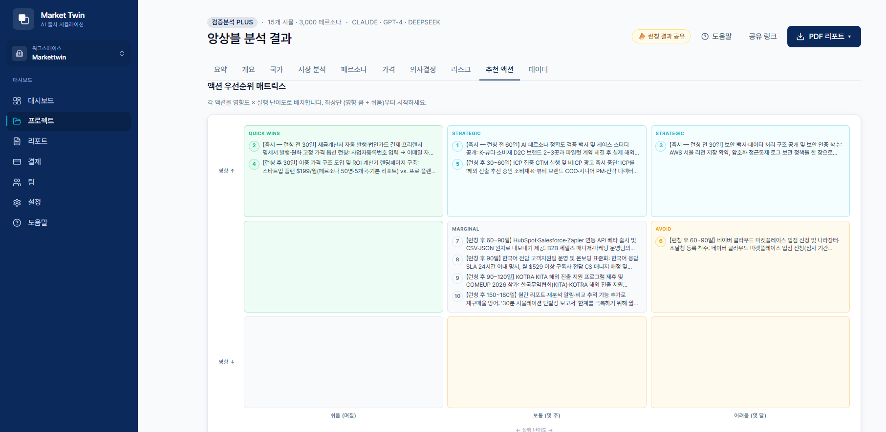

## 6.7 베타 피드백

결과 화면 하단의 *"이 결과가 의사결정에 도움이 되나요?"* 1~5점과 한 줄 의견으로 피드백을 보낼 수 있습니다. 보내주신 의견은 제품 개선에 반영됩니다.

# 7. 페르소나에게 질문하기

각 페르소나 카드의 **"질문하기"** 버튼을 누르면, 해당 페르소나에게 자연어로 질문하고 1인칭 답변을 받을 수 있습니다(예: "어떤 채널에서 사는 걸 선호하세요?"). 정량 통계만으로 알 수 없는 구체적인 구매 동기·채널 선호·거부 이유를 직접 확인할 수 있습니다.

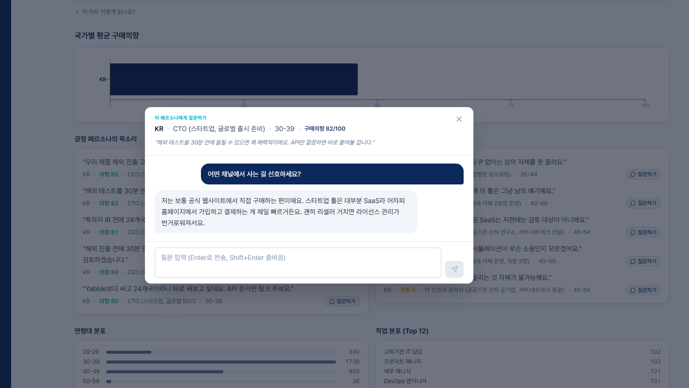

# 8. PDF 리포트

결과 화면 우측 상단 **PDF 리포트** 버튼에서 용도별 3종을 내려받을 수 있습니다.

| 종류 | 분량 | 용도 |
|---|---|---|
| 임원용 | 2~3 페이지 | Hot take·추천국·핵심 액션·가격 (경영진 보고) |
| 전체 분석 | ~30 페이지 | 투자 요구치+ROI·추천 견고성·직업별 의향·채널 우선순위·리스크×액션 |
| 교차검증 리포트 | McKinsey·BCG 스타일 | 외부 시장 데이터 정합성·신뢰 등급·단계별 실행 |

리포트는 종합 의견 → 시장 상황+경쟁자 → GTM 전략 요약 → 30/60/90일 실행 타임라인 → 국가별 디테일 순으로 구성됩니다.

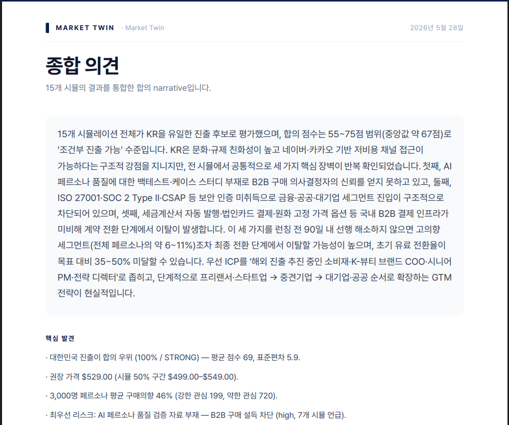

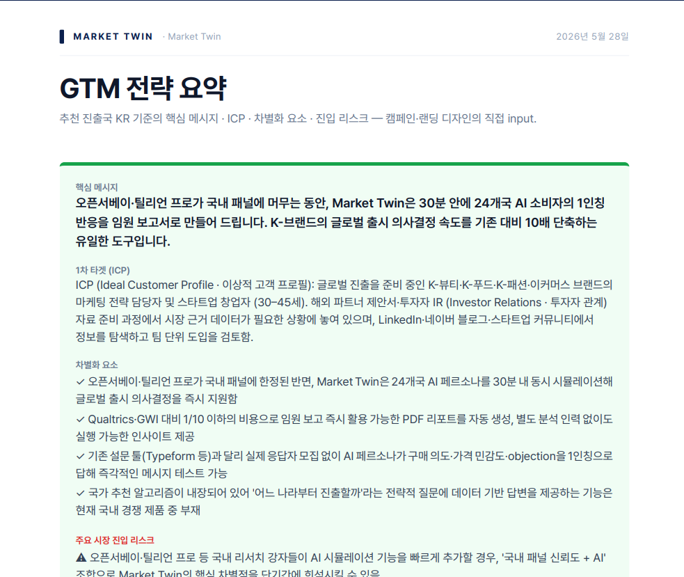

# 9. 설정

좌측 메뉴 **설정**에서 프로필·워크스페이스·알림을 관리합니다.

| 영역 | 항목 |
|---|---|
| 프로필 | 이메일, 표시 언어(한국어/English) |
| 워크스페이스 정보 | 이름·회사명·업종·국가 (결과 페이지·PDF 헤더에 노출) |
| 플랜 / 생성일 | 현재 플랜 및 워크스페이스 생성일 |
| 이메일 알림 | 시뮬레이션 완료·실패 시 등록 이메일로 결과 수신 |

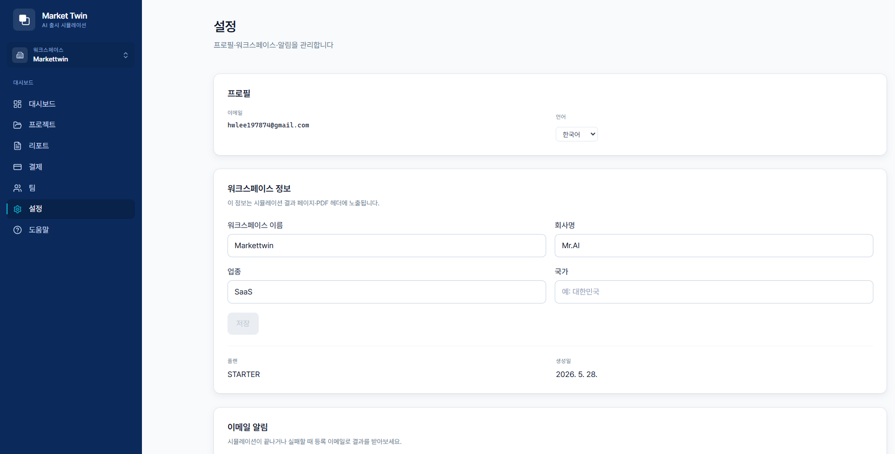

# 10. 자주 묻는 질문 (FAQ)

**Q. 결과가 나오는 데 얼마나 걸리나요?**
샘플 데모는 2~3분, 실제 제품 검증은 보통 몇 분입니다. 화면을 닫아도 결과는 보존됩니다.

**Q. 무엇이 무료인가요?**
베타 기간 동안 7일 또는 초기검증 2회까지 무료이며, 신용카드는 필요 없습니다. 샘플 데모는 하루 3회 별도로 제공됩니다.

**Q. 샘플 데모도 무료 횟수에서 차감되나요?**
아니요. 샘플 데모는 무료 검증 횟수와 별개입니다.

**Q. 내가 입력한 제품 정보는 안전한가요?**
시뮬레이션 추론을 위해 해외 LLM 제공자로 전송되며, 이는 가입 시 동의한 국외이전 안내에 따릅니다. 결제 카드정보는 보관하지 않습니다(PG사 토큰화).

**Q. 결과를 팀과 공유할 수 있나요?**
네. 결과 화면의 공유 링크로 공유할 수 있으며, 워크스페이스에 팀원을 초대해 역할(소유자/관리자/분석가/뷰어)별로 협업할 수 있습니다.

# 11. 문제 해결 (트러블슈팅)

| 증상 | 조치 |
|---|---|
| 인증 메일이 오지 않음 | 스팸함 확인 → "확인 메일 다시 보내기"(60초 간격) → 미수신 시 `contact@markettwin.ai` 문의 |
| 로그인이 안 됨 | 가입 방식(구글/이메일) 확인, 이메일 인증 완료 여부 확인 |
| 시뮬레이션이 멈춘 것 같음 | 화면을 닫아도 백그라운드로 진행됩니다. 잠시 후 결과 페이지에서 확인 |
| 결과가 예상과 다름 | 제품 설명에 외부 사실(매출·점유율)을 넣지 않았는지 확인(4.1절 주의 참고) |
| 추천 국가가 한쪽으로 치우침 | 제품 설명·입력값에 특정 국가를 암시하는 표현이 없는지 점검 |

# 12. 용어집

| 용어 | 의미 |
|---|---|
| 출시 성공 점수 | 수요·CAC·경쟁 강도 기반 0~100점 종합 평가 |
| 페르소나 | 정부 통계 기반으로 생성된 가상의 현지 소비자 |
| 구매의향 | 페르소나가 제품을 구매할 의향 점수(0~100) |
| 앙상블 | 여러 독립 시뮬레이션을 병렬 실행해 신뢰도를 높이는 방식 |
| TAM | Total Addressable Market, 전체 시장 규모 |
| CAC | Customer Acquisition Cost, 고객 획득 비용 |
| M:R | Marketing-to-Revenue, 마케팅 대 매출 비율 |
| LTV | Life-Time Value, 고객 생애 가치 |
| BREAK-EVEN | 손익분기점 |
| GTM | Go-To-Market, 시장 진입 전략 |
| 초기검증(Hypothesis) | 무료 체험에 제공되는 기본 분석 티어 |

# 13. 지원 및 문의

- **이메일**: contact@markettwin.ai
- **운영사**: 주식회사 미스터에이아이 (Mr.AI Inc.)
- 베타 기간 중 발견하신 오류·개선 아이디어는 언제든 위 이메일로 보내주시면 제품에 적극 반영하겠습니다.

*본 매뉴얼의 화면은 제품 버전에 따라 일부 다를 수 있습니다. © 2026 주식회사 미스터에이아이.*
